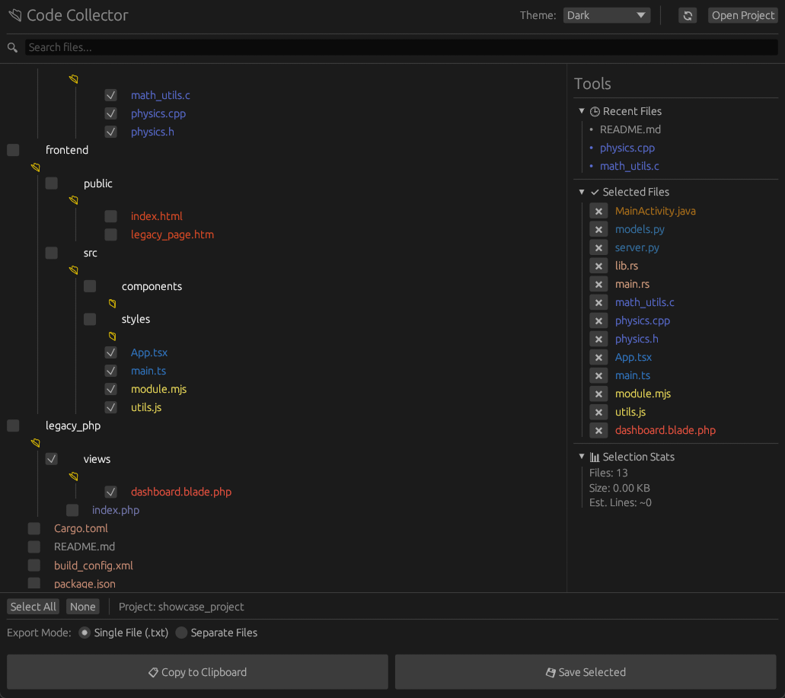
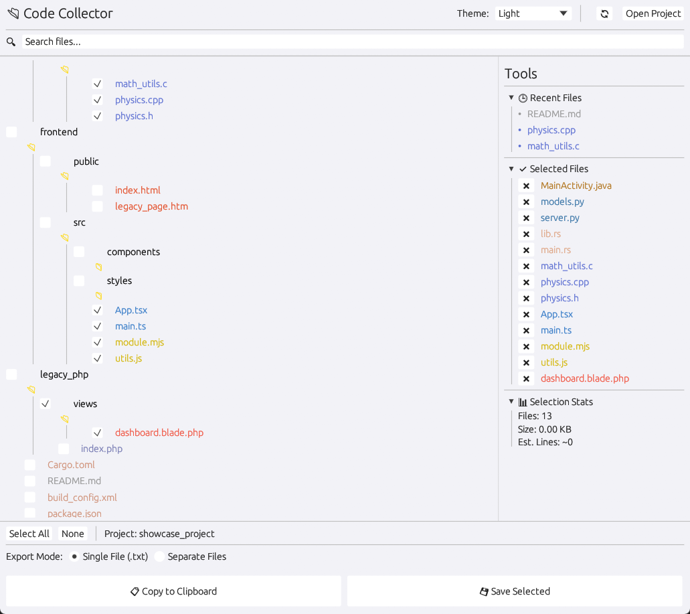

# 🚀 Rust Code Collector


[cite_start]**Code Collector** is a high-performance desktop GUI tool designed to help developers extract, filter, and export code from their projects[cite: 60]. [cite_start]It is perfect for preparing context for **LLMs (ChatGPT, Claude, DeepSeek)**, creating backups, or reviewing large codebases[cite: 60, 61].

---

## 📸 Showcase

Experience the fast, native interface in your preferred style:

| 🌙 Dark Theme | ☀️ Light Theme |
| :---: | :---: |
|  |  |

---

## 📥 Download

**Don't want to build from source?** Download the latest executable version here:

[](https://github.com/dewakuneiei/code-collector/releases/latest)

*(Note: Currently built for Windows. Linux/Mac users, please build from source below.)*

---

## ✨ Features

* [cite_start]**⚡ Blazing Fast:** Built with Rust and `egui` for instant startup and low memory usage[cite: 62].
* [cite_start]**🌳 Tree View Navigation:** Explore your project with a familiar file explorer interface[cite: 63].
* [cite_start]**🎨 Themes:** Switch between **Light**, **Dark**, or **System** themes (Apple-style Light mode included)[cite: 64].
* [cite_start]**🔍 Smart Search:** Instantly filter files across the entire project structure[cite: 65].
* [cite_start]**🔄 Smart Refresh:** Reload your project folder **without losing your selected files**[cite: 66].
* [cite_start]**🛡️ Integrity Check:** Detects if selected files have been deleted before exporting[cite: 67].
* **📝 Export Modes:**
    * [cite_start]**Single File:** Merges all code into one text file (great for AI context)[cite: 68].
    * [cite_start]**Separate Files:** Copies selected files to a new folder while preserving structure[cite: 69].
* [cite_start]**🚫 Auto-Ignore:** Automatically skips clutter like `node_modules`, `.git`, `target`, `vendor`, etc[cite: 70].

---

## 🛠️ Build from Source

[cite_start]If you are a developer, you can clone and build the project yourself[cite: 70].

### Prerequisites
* Install [Rust & Cargo](https://rustup.rs/)

### 1. Clone the Repository
```bash
git clone [https://github.com/dewakuneiei/code-collector.git](https://github.com/dewakuneiei/code-collector.git)
cd code-collector